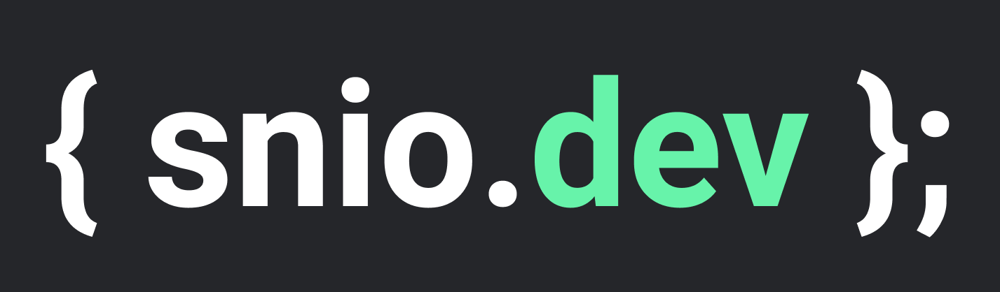
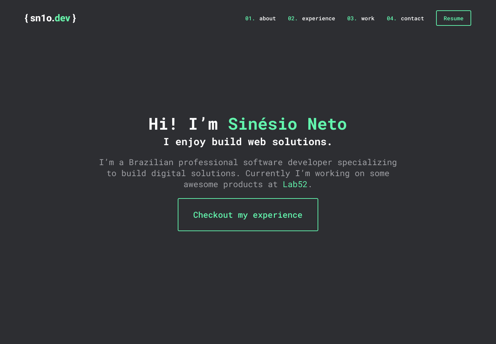
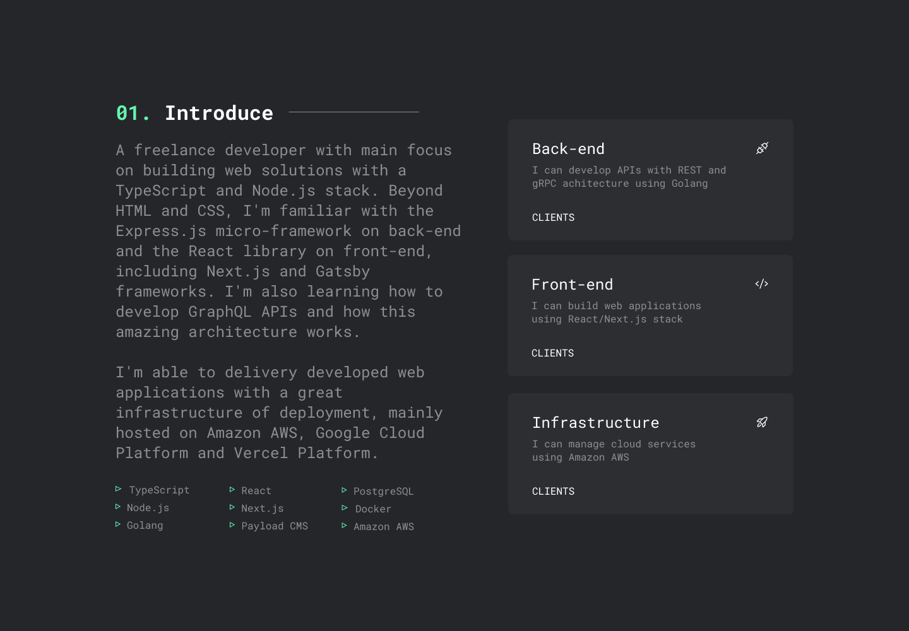
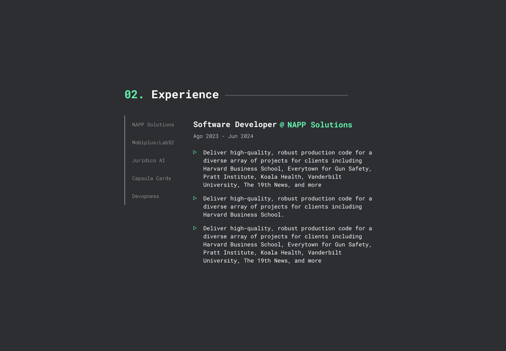
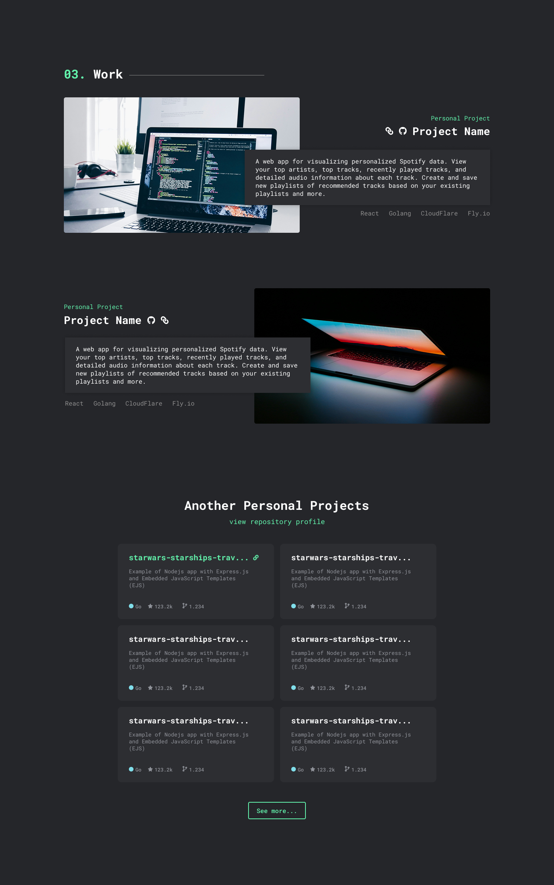
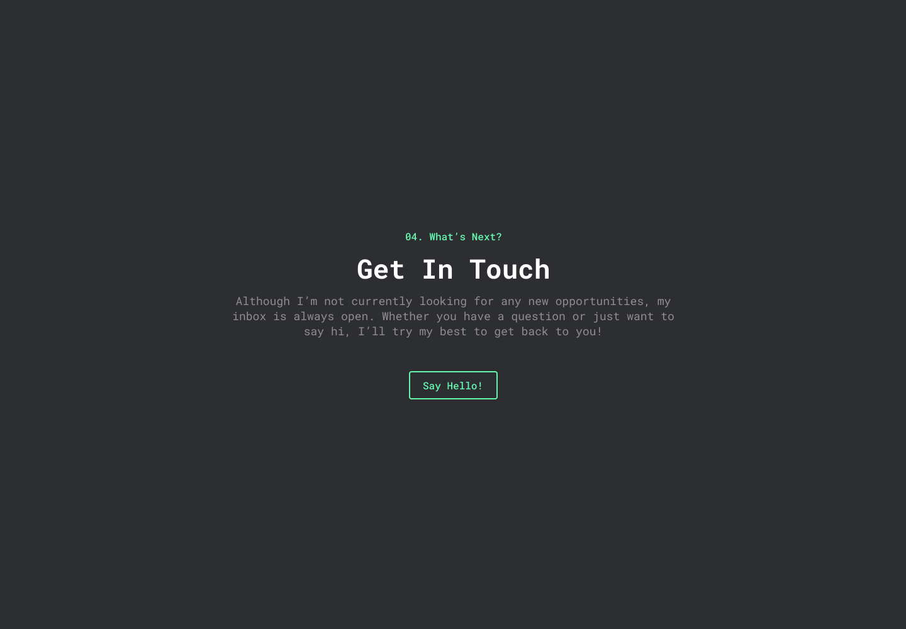

<h1 align="center">
  <a href="https://snio.dev">
    
  </a>
</h1>

<div align="center">

  <b>This project contains the source code of my personal portfolio available on: <a href="https://sn1o.vercel.app">sn1o.vercel.app</a>.</b>

[![Astro][astro-badge]][astro-badge-url] [![Qwik][qwik-badge]][qwik-badge-url] 
<!-- [![CloudFlare][cloudflare-badge]][cloudflare-badge-url]  -->

[astro-badge]: https://img.shields.io/badge/Astro-BC52EE?style=for-the-badge&logo=astro&logoColor=white
[astro-badge-url]: https://astro.build
[qwik-badge]: https://img.shields.io/badge/Qwik-18B6F6?style=for-the-badge&logo=qwik&logoColor=white
[qwik-badge-url]: https://qwik.dev
<!-- [cloudflare-badge]: https://img.shields.io/badge/CloudFlare-F38020?&style=for-the-badge&logo=Cloudflare&logoColor=white -->
<!-- [cloudflare-badge-url]: https://pages.cloudflare.com -->
</div>

<h3 align="center">
  <a href="#overview">Overview</a> •
  <a href="#requirements">Requirements</a> •
  <a href="#running-up">Running Up</a> •
  <a href="#development-considerations">Development Considerations</a> •
  <a href="#acknowledgments">Ackownledgments</a> •
  <a href="#self-promotion">Self Promotion</a> •
  <a href="#license">License</a>
</h3>

---
## OVERVIEW
|                        |                              |                                    |
|:-----------------------|:----------------------------:|-----------------------------------:|
|  |      |  |
|  |  ||

## REQUIREMENTS
- [`Bun`](https://bun.sh/) - package manager
- [`Turborepo`](https://turborepo.dev/) - monorepo project manager
- [`Astro`](https://astro.build/) - web framework
- [`Qwik`](https://qwik.dev/) - react-like web framework
- [`Biome`](https://biomejs.dev/) - formatter/linter

## RUNNING UP
If you want to run this application locally, follow the steps bellow.
1. Cloning repository
```bash
git clone https://gitlab.com/sn1o/snio.dev.git
```

2. Install dependencies
```bash
$ bun install
```

3. Running Turborepo/Astro server in develop mode
```bash
bun turbo dev --filter=site
```

4. Build and running preview mode
```bash
# build
bun turbo build --filter=site

# preview
cd apps/site && bun astro preview
```

## DEVELOPMENT CONSIDERATIONS
This project uses [Octokit.js](https://github.com/octokit/octokit.js) to fetch data from GitHub, to retrieve it repositories that will be populate the `<OpenSource />` section of the page.

To achieve that, you need to generate a *Personal access token* to allow the application do API requests. Once you generate your access token, copy/past it inside `.env` file placed in `apps/site` directory path with the key `GITHUB_TOKEN`. To deploy the application, just configure your access token in your provider as a *Environment Variable*.

## ACKNOWLEDGMENTS
- The layout inspired on [Logan Cee](https://dribbble.com/shots/11276631-DS-Personal-Developer-Portfolio);
- And heavily based on [Brittany Chiang v4 personal website](https://github.com/bchiang7/v4)

## SELF PROMOTION
Do you like this project? Come on:
- Star and follow the repository on [Gitlab](https://gitlab.com/sn1o/snio.dev).

## LICENSE
[MIT License](LICENSE)
