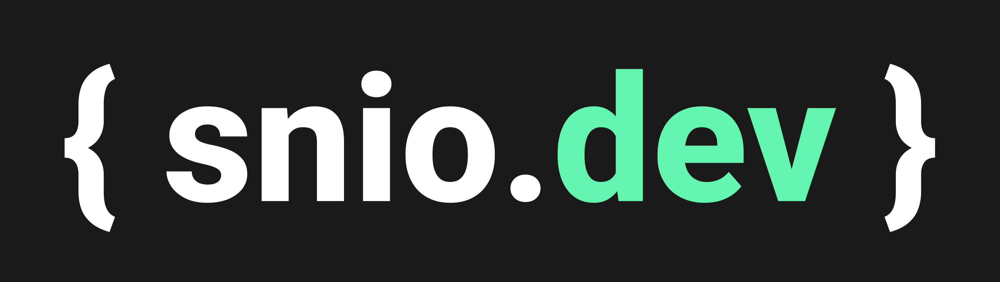

<h1 align="center">
  <a href="https://snio.dev">
    
  </a>
</h1>

<div align="center">

  <b>This project contains the source code of my personal portfolio available on: <a href="https://snio.dev">snio.dev</a>.</b>

[![Next.js][nextjs-badge]][nextjs-badge-url] [![Vercel][vercel-badge]][vercel-badge-url] [![TypesScript][typescript-badge]][typescript-badge-url] [![GitHub Actions][github-actions-badge]][github-actions-url] [![Lincese MIT][license-badge]][license-badge-url]

[nextjs-badge]: https://img.shields.io/badge/next%20js%20-%23000000.svg?&style=for-the-badge&logo=next.js&logoColor=white
[nextjs-badge-url]: https://nextjs.org
[vercel-badge]: https://img.shields.io/badge/vercel%20-%23000000.svg?&style=for-the-badge&logo=vercel&logoColor=white
[vercel-badge-url]: https://vercel.com
[typescript-badge]: https://img.shields.io/badge/typescript%20-%23007ACC.svg?&style=for-the-badge&logo=typescript&logoColor=white
[typescript-badge-url]: https://typescriptlang.org
[github-actions-badge]: https://img.shields.io/badge/github%20actions%20-%232671E5.svg?&style=for-the-badge&logo=github%20actions&logoColor=white
[github-actions-url]: https://github.com/sineto/snio.dev/actions
[license-badge]: https://img.shields.io/badge/License-MIT-green?style=for-the-badge
[license-badge-url]: https://github.com/sineto/snio.dev/blob/develop/LICENSE
</div>

<h3 align="center">
  <a href="#requirements">Requirements</a> •
  <a href="#running-up">Running Up</a> •
  <a href="#development-considerations">Development Considerations</a> •
  <a href="#acknowledgments">Ackownledgments</a> •
  <a href="#self-promotion">Self Promotion</a> •
  <a href="#license">License</a>
</h3>

---

## REQUIREMENTS
The website was built using:
- [Nextjs](https://nextjs.org) (10.0.5)
- [Styled Components](https://tailwindcss.com/) (5.2.1)
- [React Helmet](https://purgecss.com/) (6.1.0)
- [TypeScript](https://typescriptlang.org) (4.1.3)

## RUNNING UP
If you want to run this application localy, follow the steps bellow.

1. **Cloning repository**
    ```sh
    $ git clone https://github.com/sineto/snio.dev
    ```

2. **Install dependencies**
    ```sh
    # This project uses Yarn as package manager.
    # So, install Yarn first.
    $ npm install --global yarn

    # install project dependencies
    $ cd snio.dev
    $ yarn install
    ```

3. **Running Next.js server in `develop` mode**
    ```sh
    $ yarn dev
    ```

4. **Running Next.js server in `production` mode**
    ```sh
    $ yarn build
    $ yarn start
    ```

## DEVELOPMENT CONSIDERATIONS
This project is being developed under some standards that I intend to follow.

1. **Commit stage**

    Before every commit action some triggers took automations.
    - **Git commit message** need to follow the [**Angular Commit Message Guidelines**](https://github.com/angular/angular/blob/master/CONTRIBUTING.md#-commit-message-format);
    - **ESLint** will check some patterns based on [**StandardJs**](https://standardjs.com) rules;
    - **Prettier** will format the code out of the rules. Those rules was based on my own preferences;

2. **Running code linter manually**
    ```sh
    $ yarn lint
    ```

3. **Running code format manually**
    ```sh
    $ yarn format
    ```

## ACKNOWLEDGMENTS
- This project was built during Fullstack Master class
by [DevPleno](https://devpleno.com/).
- The layout credits mainly go to [Logan Cee](https://dribbble.com/shots/11276631-DS-Personal-Developer-Portfolio).

## SELF PROMOTION
Do you like this project? Come on:
- Star and follow the repository on [GitHub](https://github.com/sineto/snio.dev).
- Follow me on
  - [GitHub](https://github.com/sineto)

## LICENSE
[MIT License](LICENSE)
